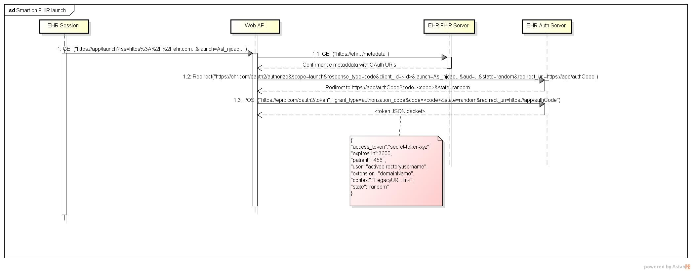

# SMART on FHIR Application Launch - Server Side Simulator

## [HL7 Standard](http://www.hl7.org/fhir/smart-app-launch/)

* EHR Server Side Simulator provides a federated token
* Based on state-of-the-art IT Cybersecurity Standards: [OAuth 2.0](https://oauth.net/2/) & [OpenId Connect](https://openid.net/connect/)
* Supports the [Public App](http://www.hl7.org/fhir/smart-app-launch/#use-the-public-app-profile-if-your-app-is-unable-to-protect-a-client_secret) & [EHR Launch](http://www.hl7.org/fhir/smart-app-launch/#ehr-launch-sequence) profile

## UML Sequence Diagram

